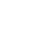

<!-- .slide: class="slide-title" -->

# Metodologías y herramientas computacionales para el procesamiento y modelado de datos gravimétricos

<hr>

<h2>
<a href="https://www.santisoler.com">
Lic. Santiago Soler
</a>
</h2>

<div class="container">
<div class="column">
<h3> Dr. Mario E. Gimenez</h3>
<p> <em>Director</em> </p>
</div>
<div class="column">
<h3> <a href="https://www.leouieda.com">Dr. Leonardo Uieda</a> </h3>
<p> <em>Codirector</em> </p>
</div>
</div>

<div class="container logos">
<div class="logo">
<a href="https://www.conicet.gov.ar/">

</a>
</div>
<div class="logo">
<a href="https://www.unsj.edu.ar/">

</a>
</div>
<div class="logo">
<a href="http://igsv.unsj.edu.ar/">

</a>
</div>
</div>

---

# Contenido

1. Introducción y motivación
1. Tesseroides densidad variable
1. Fuentes equivalentes potenciadas por gradiente
1. Fatiando a Terra
1. Conclusiones

---

# Regular slide

## With subtitles

---

# Do you want columns?

<div class="container">

<div class="column">

</div>

<div class="col-2">
<div class="centered">

* Licenciado en Física (UNR)
* Estudiante de Doctorado en Geofísica (UNSJ)
* Becario Doctoral de CONICET
* Desarrollador de [Fatiando a Terra](https://www.fatiando.org)
* Miembro de [Computer-Oriented Geoscience Lab](https://www.compgeolab.org)

</div>
</div>

</div>

---

# You can add fade-in animations

<div class="container">

<div class="column fragment fade-in">

First element

</div>

<div class="column fragment fade-in">

Second element

</div>

</div>

---

## Even on lists

<ul>
<li class="fragment fade-in">First element</li>
<li class="fragment fade-in">Second element</li>
<li class="fragment fade-in">Third element</li>
</ul>

---

## Highlight current item on list

<ol>
<li class="fragment highlight-current-green">First element</li>
<li class="fragment highlight-current-green">Second element</li>
<li class="fragment highlight-current-green">Third element</li>
</ol>

---

# You can put footnotes

<div class="bottom">

https://www.blog.pythonlibrary.org/2019/04/11/python-used-to-take-photo-of-black-hole/

</div>

---

<!-- .slide: data-background-color="#eceff4" -->

## You can change the background color

---

## Add quotes

<blockquote>
This is a quote
</blockquote>

---

## Add code

```python
import numpy as np
import matplotlib.pyplot as plt

a = np.linspace(0, 10, 11)

plt.plot(a, a ** 2)
plt.show()
```

---

# Contacto

<div>

<ul class="fa-ul">
<li><i class="fa-li fa fa-envelope"></i>

[santiago.r.soler@gmail.com](mailto:santiago.r.soler@gmail.com)

</li>
<li><i class="fa-li fab fa-twitter"></i>

[@santirsoler](https://twitter.com/santirsoler)

</li>
<li><i class="fa-li fa fa-globe-americas"></i>

[www.santisoler.com](https://www.santisoler.com)

</li>
</ul>

</div>

---

<!-- .slide: class="slide-license" -->

<p class="license-icons">
<i class="fab fa-creative-commons"></i><i class="fab fa-creative-commons-by"></i>
</p>

El contenido de esta presentación está disponible bajo <br>
[Creative Commons Attribution 4.0 International License](https://creativecommons.org/licenses/by/4.0/)

---

<!-- .slide: class="slide-title" -->

# Muchas gracias
