<!-- .slide: class="slide-title" -->

<h1>
Metodologías y herramientas computacionales para el
procesamiento y modelado de datos gravimétricos
</h1>

<hr>

<h2>
<a href="https://www.santisoler.com">
Lic. Santiago Soler
</a>
</h2>

<div class="container">
<div class="column">
<h3> Dr. Mario E. Gimenez</h3>
<p> <em>Director</em> </p>
</div>
<div class="column">
<h3> <a href="https://www.leouieda.com">Dr. Leonardo Uieda</a> </h3>
<p> <em>Codirector</em> </p>
</div>
</div>

<div class="container logos">
<div class="logo">
<a href="https://www.conicet.gov.ar/">

</a>
</div>
<div class="logo">
<a href="https://www.unsj.edu.ar/">

</a>
</div>
<div class="logo">
<a href="http://igsv.unsj.edu.ar/">

</a>
</div>
</div>

---

## Contenido

1. Introducción
1. Teseroides densidad variable
1. Fuentes equivalentes potenciadas por gradiente
1. Fatiando a Terra
1. Conclusiones

---

# Introducción

---

<!-- .slide: data-background-color="#2b2b2b" -->

# Teseroides de densidad variable

---

## ¿Qué es un teseroide?

---

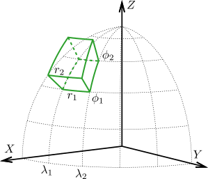

---

## Problema

---

### Campos gravitatorios

$$
    V(\mathbf{p}) = G \rho
        \int\limits_{r_1}^{r_2}
        \int\limits_{\lambda_1}^{\lambda_2}
        \int\limits_{\phi_1}^{\phi_2}
        \frac{\kappa}{\left\lVert \mathbf{p} - \mathbf{q} \right\rVert}
        \text{d} r' \text{d} \lambda' \text{d} \phi',
$$

No poseen solución analítica

---

## Solución

---

### Cuadratura de Gauss-Legendre

<div class="container container-70">

<div class="column">
$$
V(\mathbf{p}) \cong
G \rho
A
\sum\limits_{i=1}^{N_r}
\sum\limits_{j=1}^{N_\lambda}
\sum\limits_{k=1}^{N_\phi}
W_{ijk}
\frac{\kappa_{ik}}{\left\lVert \mathbf{p} - \mathbf{q}_{ijk} \right\rVert}
$$
</div>

<div class="column">
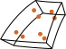
</div>

</div>

Aproxima el teseroide por masas puntuales

---

<i class='fas fa-arrow-circle-up'></i> Orden de la Cuadratura
$ \Rightarrow $
<i class='fas fa-arrow-circle-up'></i> Precisión


<p class="fragment" style="margin-top: 100px">
Pero... $ \mathcal{O}(n^3) $ 😞
</p>

---

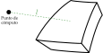

<i class='fas fa-arrow-circle-up'></i> Distancia a punto de cómputo
$ \Rightarrow $
<i class='fas fa-arrow-circle-up'></i> Precisión

---

## Discretización adaptativa

---

<div class="r-stack">


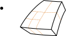
</div>

<p class="fragment fade-in">
Masas puntuales donde más se necesitan
</p>

---

# Teseroides de densidad variable

---

<div>
$$
    V(\mathbf{p}) = G \color{#e4564a}{\rho}
        \int\limits_{r_1}^{r_2}
        \int\limits_{\lambda_1}^{\lambda_2}
        \int\limits_{\phi_1}^{\phi_2}
        \frac{\kappa}{\left\lVert \mathbf{p} - \mathbf{q} \right\rVert}
        \text{d} r' \text{d} \lambda' \text{d} \phi',
$$
</div>

<div class="fragment">
<i class="fas fa-arrow-down"></i>

$$
    V(\mathbf{p}) = G
        \int\limits_{r_1}^{r_2}
        \int\limits_{\lambda_1}^{\lambda_2}
        \int\limits_{\phi_1}^{\phi_2}
        \color{#e4564a}{\rho(r')}
        \frac{\kappa}{\left\lVert \mathbf{p} - \mathbf{q} \right\rVert}
        \text{d} r' \text{d} \lambda' \text{d} \phi',
$$
</div>

---

## Desafío

Función densidad en la aproximación numérica

---

### Discretización basada en densidad

---

<div class="r-stack">
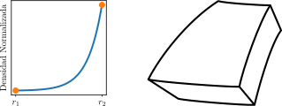
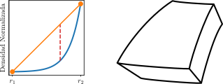
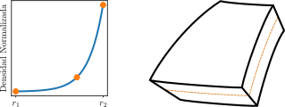
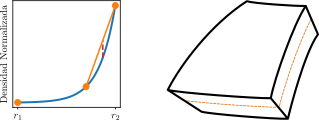
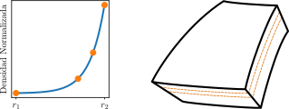
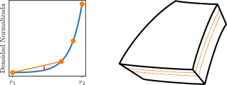
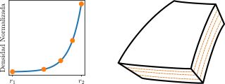
</div>

---

### Discretización adaptativa bidimensional

---

<div class="r-stack">
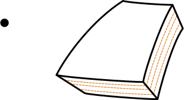
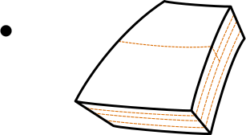
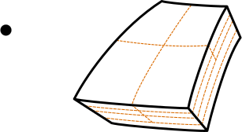
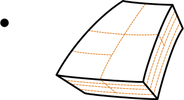
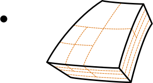
</div>

---

### Cuadratura de Gauss-Legendre


<div class="container container-70">

<div class="column">
$$
V(\mathbf{p}) \cong
G
A
\sum\limits_{i=1}^{2}
\sum\limits_{j=1}^{2}
\sum\limits_{k=1}^{2}
W_{ijk}
\frac{\color{#e4564a}{\rho(r_i)}\kappa_{ik}}{\left\lVert \mathbf{p} - \mathbf{q}_{ijk} \right\rVert}
$$

</div>

<div class="column">
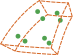
</div>

</div>

Aplicada sobre cada teseroide pequeño

---

### Resumen del nuevo método

1. Discretización basada en densidad
2. Discretización adaptativa bidimensional
3. Cuadratura Gauss-Legendre

---

## Precisión y tiempo de cómputo

---

<div class="container container-70">

<div class="column">

Discretización basada en densidad

<i class='fas fa-arrow-down'></i>

<p style="font-size: 5rem;">
$\delta$
</p>

</div>

<div class="column">

Discretización adaptativa bidimensional

<i class='fas fa-arrow-down'></i>

<p style="font-size: 5rem;">
$D$
</p>

</div>

</div>

$D$ y $\delta$ controlan la **cantidad de subdivisiones**

---

<div class="container container-70">

<div class="col-3" style="text-align: right">
<i class='fas fa-arrow-circle-up'></i> Subdivisiones
</div>

<div class="column">
$\Rightarrow$
</div>

<div class="col-3" style="text-align: left">

<i class='fas fa-arrow-circle-up' style="color: #50a14f;"></i> Precisión

<i class='fas fa-arrow-circle-up' style="color : #e4564a;"></i> Tiempo de cómputo

</div>

</div>

---

## Determinación de $D$ y $\delta$

---

### Comparaciones con soluciones analíticas <br>para cascarones esféricos

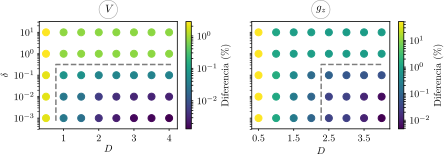

---

### Valores óptimos para $D$ y $\delta$:

- $D = 1$ para potencial $V$
- $D = 2.5$ para aceleración $\mathbf{g}$
- $\delta = 0.1$

🎉 Garantizan **errores** por **debajo del 1%** 🎉

---

# Aplicación a la Cuenca Neuquina

---

### Cuencas sedimentarias de gran tamaño

- Sedimentos con **compactación**
- **Curvatura del planeta** por su gran extensión

---

## Modelo de la cuenca Neuquina


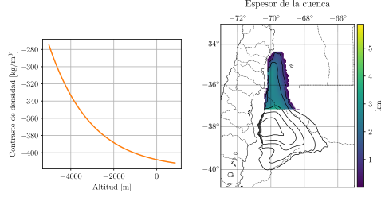

---

## Campos gravitatorios del modelo


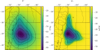

---

## Diferencias con densidad constante


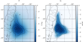

---

<!-- .slide: data-background-color="#2b2b2b" -->

# Fuentes equivalentes <br> potenciadas por gradiente

---

## ¿Qué son las fuentes equivalentes?

---


### Datos gravimétricos

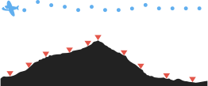

---

<div class="container">

<div class="column">

Muestras sobre terreno

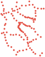
</div>

<div class="column">

Muestras aéreas


</div>

</div>

---

### Interpolación

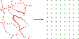

---


### Interpoladores 2D de propósito general


<div class="container container-70" style="margin-top: 3rem;">

<div class="column fragment">

</div>

<div class="column fragment">

</div>

</div>

---

### Fuentes equivalentes

---

<div class="r-stack">
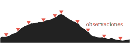
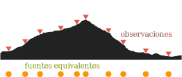
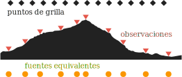
</div>

---

### Ventajas

<div class="container container-70" style="margin-top: 3rem;">

<div class="column fragment">
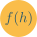
</div>

<div class="column fragment">
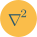
</div>

</div>

---

### Problema

<div class="r-stack">
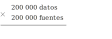

</div>

---

### Solución

---

# Fuentes equivalentes <br> potenciadas por gradiente

---

## Potenciación del gradiente


<div class="container container-60" style="margin-top: 5rem;">

<div class="col-3" >

$$ \mathbf{d} = \mathbf{A} \mathbf{c} $$

</div>

<div class="column fragment" data-fragment-index="1">
<i class='fas fa-arrow-right'></i>
</div>

<div class="col-3 fragment" data-fragment-index="1">

$$ \mathbf{d} = \sum\limits_{k=1}^K \mathbf{A}_k \mathbf{c}_k $$

</div>

</div>

---

## Fuentes equivalentes <br> potenciadas por gradiente

---

<div class="r-stack">

<div class="fragment fade-out" data-fragment-index="0" style="width: 100%">
<p>Datos observados</p>
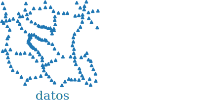
</div>

<div class="fragment current-visible" data-fragment-index="0" style="width: 100%">
<p>Defino fuentes</p>
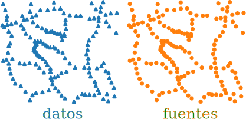
</div>

</div>

---

#### Ventanas solapadas

<div class="r-stack">

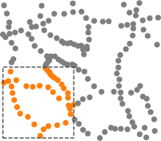
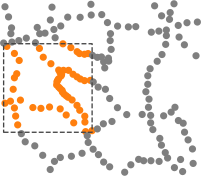
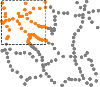
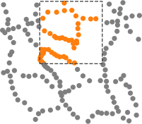
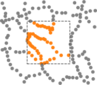
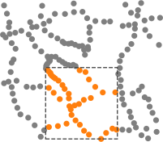
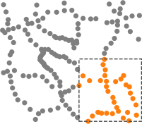
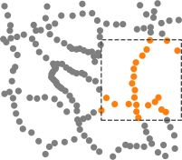
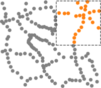

</div>

---

### Ajustamos fuentes equivalentes iterativamente

---

<div class="r-stack">

<div class="fragment fade-out" data-fragment-index="0" style="width: 100%">
<p>Ajuste de <strong>fuentes</strong> de la primer ventana</p>
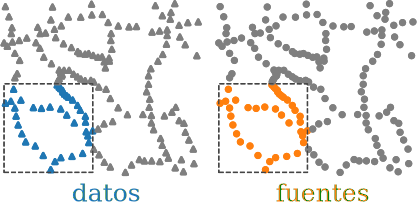
</div>

<div class="fragment current-visible" data-fragment-index="0" style="width: 100%">
<p>Cálculo del efecto de las <strong>fuentes</strong> y definición de
<strong>residuos</strong></p>
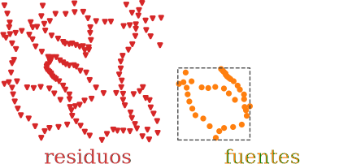
</div>

<div class="fragment current-visible" style="width: 100%">
<p>Ajuste de <strong>fuentes</strong> de la segunda ventana</p>
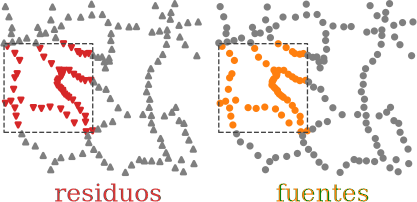
</div>

<div class="fragment" style="width: 100%">
<p>Cálculo del efecto de las <strong>fuentes</strong> y actualización de
<strong>residuos</strong></p>
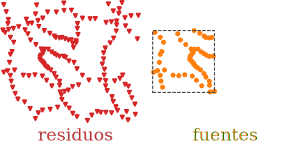
</div>

</div>

---

### Repetimos para todas las ventanas

---

## Características

<ul>
<li class="fragment">Superposición de ventanas: <strong>autocorrección</strong></li>
<li class="fragment">Ajuste sobre <strong>datos en ventana</strong></li>
<li class="fragment"><strong>Predicciones libres</strong></li>
</ul>

---

# Ubicación de las fuentes

---

## Fuentes debajo de datos

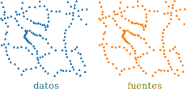

<p class="fragment">
Posible anisotropía $\Rightarrow$ <strong>aliasing</strong>
</p>

---

## Fuentes en grilla regular

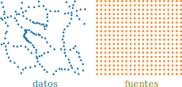

<p class="fragment">
$M$ fuentes > $N$ datos $\Rightarrow$ problema <strong>subdeterminado</strong>
</p>

---

# Fuentes promediadas por bloque

---

<div class="r-stack">
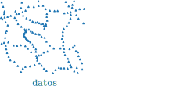
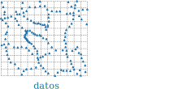
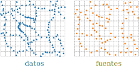

</div>

---

## Características

<ul>
    <li>Evita <strong>anisotropías</strong></li>
    <li>$N$ datos > $M$ fuentes</li>
    <ul style="margin-left: 100px">
        <li>Problema <strong>sobredeterminado</strong></li>
        <li>Reduce uso de memoria</li>
    </ul>
    <li><strong>Tamaño de bloques</strong> controla <strong>cantidad de fuentes</strong></li>
</ul>

---

# Prueba con datos sintéticos


---

## Resultados

---

### Fuentes promediadas por bloque

<ul >
    <li class="fragment">Precisión equivalente</li>
    <li class="fragment">Menor cantidad de fuentes: reduce uso de memoria</li>
</ul>

---

### Fuentes equivalentes potenciadas por gradiente

<ul>
    <li class="fragment">Menor precisión</li>
    <li class="fragment">Menor tiempo de cómputo</li>
    <li class="fragment">
        <i class='fas fa-arrow-circle-up'></i> Tamaño de ventana
        <i class='fas fa-arrow-circle-up'></i> Precisión
    </li>
    <li class="fragment">Ventanas aleatorias: mejores predicciones</li>
</ul>

---

# Grillado de datos <br> gravimétricos de Australia

---

+1.7 millones de puntos

<div class="container" style="align-items: center;">
<div class="column">

</div>
<div class="column">

</div>
</div>


---

Grillados con fuentes equivalentes potenciadas con gradiente

<div class="container" style="align-items: center;">
<div class="column">

</div>
<div class="column">

</div>
</div>


---

<!-- .slide: data-background-color="#2b2b2b" -->

# Fatiando a Terra

---

# Conclusiones

---


# Math

$$  \color{#bf0101}{f(x)}  = \int\limits_{0}^{1} g(x) dx $$

---

# Regular slide

## With subtitles

---

# Do you want columns?

<div class="container">

<div class="column">

</div>

<div class="col-2">
<div class="centered">

* Licenciado en Física (UNR)
* Estudiante de Doctorado en Geofísica (UNSJ)
* Becario Doctoral de CONICET
* Desarrollador de [Fatiando a Terra](https://www.fatiando.org)
* Miembro de [Computer-Oriented Geoscience Lab](https://www.compgeolab.org)

</div>
</div>

</div>

---

# You can add fade-in animations

<div class="container">

<div class="column fragment fade-in">

First element

</div>

<div class="column fragment fade-in">

Second element

</div>

</div>

---

## Even on lists

<ul>
<li class="fragment fade-in">First element</li>
<li class="fragment fade-in">Second element</li>
<li class="fragment fade-in">Third element</li>
</ul>

---

## Highlight current item on list

<ol>
<li class="fragment highlight-current-red">First element</li>
<li class="fragment highlight-current-red">Second element</li>
<li class="fragment highlight-current-red">Third element</li>
</ol>

---

# You can put footnotes

<div class="bottom">

https://www.blog.pythonlibrary.org/2019/04/11/python-used-to-take-photo-of-black-hole/

</div>

---

<!-- .slide: data-background-color="#eceff4" -->

## You can change the background color

---

## Add quotes

<blockquote>
This is a quote
</blockquote>

---

## Add code

```python
import numpy as np
import matplotlib.pyplot as plt

a = np.linspace(0, 10, 11)

plt.plot(a, a ** 2)
plt.show()
```

---

# Contacto

<div>

<ul class="fa-ul">
<li><i class="fa-li fa fa-envelope"></i>

[santiago.r.soler@gmail.com](mailto:santiago.r.soler@gmail.com)

</li>
<li><i class="fa-li fab fa-twitter"></i>

[@santirsoler](https://twitter.com/santirsoler)

</li>
<li><i class="fa-li fa fa-globe-americas"></i>

[www.santisoler.com](https://www.santisoler.com)

</li>
</ul>

</div>

---

<!-- .slide: class="slide-license" -->

<p class="license-icons">
<i class="fab fa-creative-commons"></i><i class="fab fa-creative-commons-by"></i>
</p>

El contenido de esta presentación está disponible bajo <br>
[Creative Commons Attribution 4.0 International License](https://creativecommons.org/licenses/by/4.0/)

---

<!-- .slide: class="slide-title" -->

# Muchas gracias
